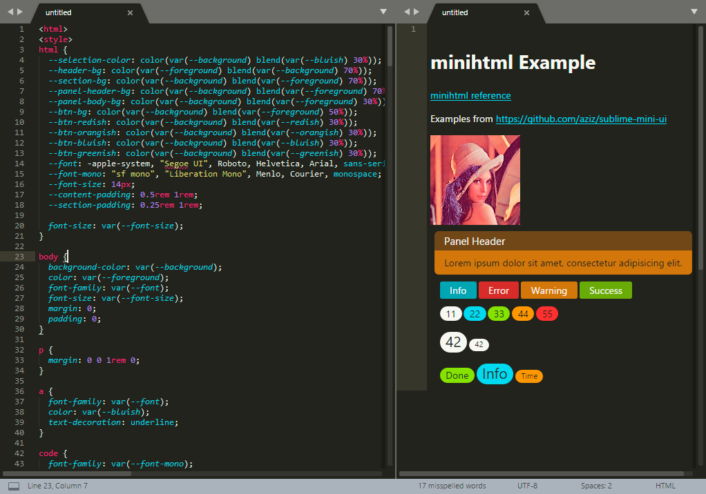

# minihtml Preview
This is a simple tool for [Sublime Text](https://www.sublimetext.com/) plugin
developers to develop and test
[minihtml](https://www.sublimetext.com/docs/3/minihtml.html) content.

## Installation
Currently you need to clone this git repository into your Packages folder.

## Usage
Open the Sublime Palette (<kbd>Command</kbd><kbd>Shift</kbd><kbd>P</kbd> on OS
X, <kbd>Ctrl</kbd><kbd>Shift</kbd><kbd>P</kbd> on Linux/Windows) and run the
**`minihtml Preview: Open Window`** command.  This will open a new window
where you can edit some minihtml source and get a real-time preview of what it
will look like.

## Screenshot

